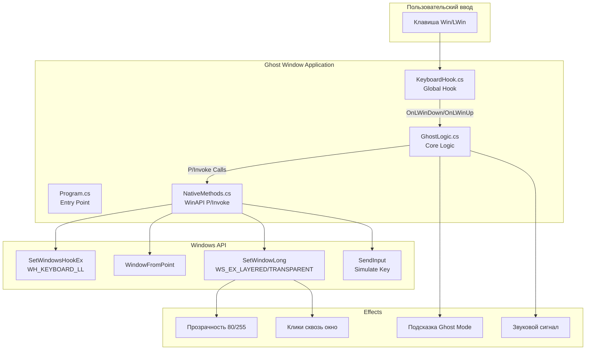
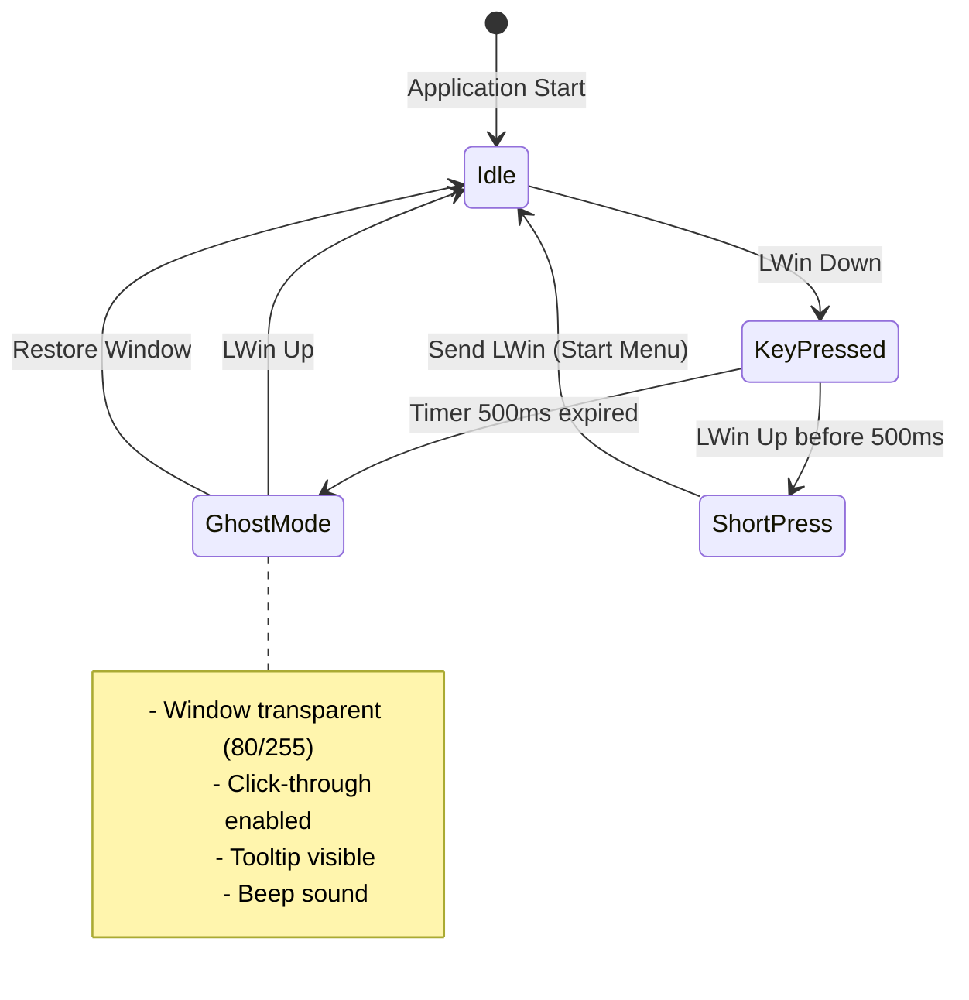

# Ghost Window - Architecture

## System Overview

## Component Breakdown

### 1. Program.cs
- **Responsibility**: Точка входа, инициализация, single instance check
- **Key Features**:
  - Mutex для предотвращения множественных запусков
  - Инициализация GhostLogic и KeyboardHook
  - Привязка событий клавиатуры к логике
  - Application.Run без видимой формы

### 2. KeyboardHook.cs
- **Responsibility**: Глобальный перехват клавиатуры
- **Pattern**: IDisposable с низкоуровневым хуком (WH_KEYBOARD_LL)
- **Key Features**:
  - SetWindowsHookEx с LowLevelKeyboardProc
  - События OnLWinDown и OnLWinUp
  - Возврат (IntPtr)1 для подавления стандартного поведения Win
  - CallNextHookEx для передачи другим хукам

### 3. GhostLogic.cs
- **Responsibility**: Основная логика Ghost Mode
- **Pattern**: IDisposable, состояние машины
- **Key Features**:
  - Timer на 500ms для определения длинного/короткого нажатия
  - Отслеживание состояния (_isLWinDown, _ghostModeActive)
  - Определение целевого окна через WindowFromPoint + GetAncestor
  - Фильтрация системных окон (Progman, WorkerW, Shell_TrayWnd)
  - Применение WS_EX_LAYERED + WS_EX_TRANSPARENT
  - SetLayeredWindowAttributes для прозрачности
  - Всплывающая подсказка (Form + Label)
  - SendInput для симуляции нажатия Win (открытие меню Пуск)

### 4. NativeMethods.cs
- **Responsibility**: P/Invoke объявления Windows API
- **Categories**:
  - **Hooking**: SetWindowsHookEx, UnhookWindowsHookEx, CallNextHookEx
  - **Window Info**: WindowFromPoint, GetWindowLong, SetWindowLong, GetClassName, GetAncestor
  - **Visual Effects**: SetLayeredWindowAttributes
  - **Input**: SendInput с INPUT/KEYBDINPUT структурами
  - **Cursor**: GetCursorPos
  - **Sound**: Beep

## State Machine

## Critical Implementation Paths

### Path 1: Activating Ghost Mode
1. User holds LWin > 500ms
2. Timer.Tick fires → OnTimerTick()
3. GetCursorPos() → WindowFromPoint() → GetAncestor(GA_ROOT)
4. GetClassName() filter check (ignore Progman, WorkerW, Shell_TrayWnd)
5. GetWindowLong(GWL_EXSTYLE) save original style
6. SetWindowLong() add WS_EX_LAYERED | WS_EX_TRANSPARENT
7. SetLayeredWindowAttributes() set alpha to 80
8. ShowTooltip() at cursor position
9. Beep(1000, 50)

### Path 2: Restoring Window
1. User releases LWin
2. OnKeyUp() called
3. _ghostModeActive check
4. SetWindowLong() restore _originalExStyle
5. If was layered: SetLayeredWindowAttributes(255)
6. HideTooltip()
7. Beep(500, 50)

### Path 3: Short Press (Start Menu)
1. User releases LWin < 500ms
2. _ghostModeActive = false
3. SendLWinClick() with SendInput
4. Two INPUT structs: KEYDOWN + KEYUP
5. Windows opens Start Menu

## Design Patterns

1. **Singleton (de facto)**: Single instance через Mutex
2. **Observer**: События OnLWinDown/OnLWinUp
3. **Disposable**: KeyboardHook и GhostLogic реализуют IDisposable
4. **P/Invoke Wrapper**: NativeMethods как статический класс-обертка
5. **State Machine**: Управление состоянием нажатия и режима

## Error Handling
- Try-catch вокруг ApplyGhostMode() с fallback на RestoreWindow()
- Проверка валидности _targetHwnd перед восстановлением
- Сохранение флага _hasOriginalExStyle для безопасного восстановления
